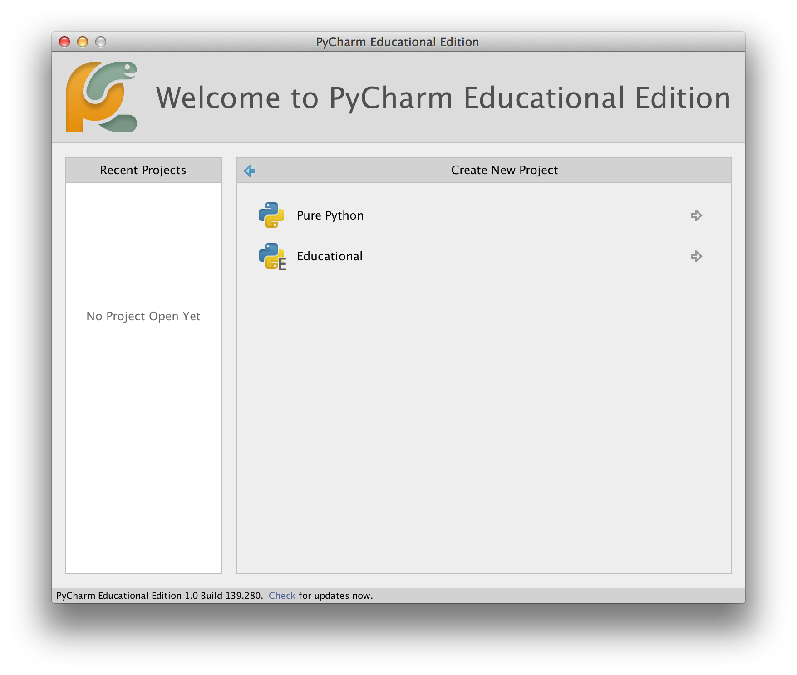
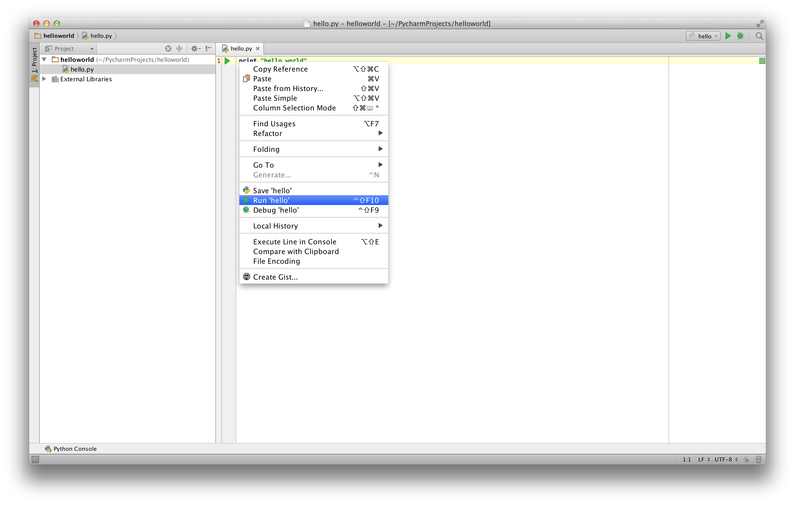

<div dir=rtl>

# گام اولیه


حالا وقتش رسیده که برنامه سنتی 'Hello World' را در پایتون اجرا کنیم. این به شما نوشتن، ذخیره کردن و اجرای برنامه‌ی پایتون را یاد می‌دهد.


دو روش برای اجرای برنامه‌ی شما در پایتون موجود است. با استفاده از مترجم تعاملی و یا با استفاده منبع فایل می‌توانیم این کار را انجام دهیم. حال، چگونگی استفاده از هر دو روش را خواهیم دید.


## استفاده از شل تعاملی

ترمینال خود را در سیستم عامل خود باز کنید(همانطور که قبلا در فصل قبلی اشاره شد
[Installation](./installation.md#installation) )و بعد برنامه‌ی پایتون را باز کنید. با نوشتن  `python3` و  دکمه‌ `[enter]` کیبورد را فشار دهید. 

پس از انکه پایتون را اجرا کردید شما همچین سمبلی  `>>>`  را مشاهده خواهید کرد.جاییکه شما می‌توانید مسائل خود را تایپ کنید. به این _مترجم تعاملی پایتون_ (_Python interpreter prompt_) می‌گویند.

در مترجم فوری:

<div dir=ltr>


```python
print("Hello World")
```

<div dir=rtl>


بعد از فشار دادن کلید  `[enter]` کیبورد، شما باید جمله‌ی `Hello World` را چاپ شده برروی صفحه نمایش خود ببینید.

در اینجا یک مثالی از کامپیوتر مکینتاش خواهید دید. جزئیات درباره‌ی برنامه‌های پایتون ممکن است در کامپیوترهای شما متفاوت باشند. اما (بعد از این سمبل `>>>`) باید یکی باشد اگرچه سیستم عامل‌ها متفاوت باشند.

<div dir=ltr>

```python
> python3
Python 3.5.1 (default, Jan 14 2016, 06:54:11)
[GCC 4.2.1 Compatible Apple LLVM 7.0.2 (clang-700.1.81)] on darwin
Type "help", "copyright", "credits" or "license" for more information.
>>> print("Hello World")
Hello World
```

<div dir=rtl>

توجه داشته باشید که، پایتون سریعا جواب یا خروجی را می‌دهد. چیزی که همین الان نوشتید این یک  _statement_ پایتون است. ما برای چاپ هر مقداری از `print` (جایی برای تعب نیست) استفاده می‌کنیم. در اینجا ما از متن `Hello World` استفاده کردیم که سریعا برروی صفحه‌ی نمایش نشان داده می‌شود.

### چگونگی خارج شدن از شل 

اگر شما از گنو لینوکس با مک استفاده می‌کنید برای خارج شدن کافی است از کلید  `[ctrl + d]` یا نوشتن  `exit()` (پراتنز  `()` را به یاد داشته باشید ) و برروی دکمه‌ی `[enter]` کیبورد فشار دهید، می‌توان این کار را انجام دهید.

اگر هم از خط فرمان ویندوز استفاده می‌کنید با استفاده از کلید`[ctrl + z]` و بعد برروی دکمه‌ی `[enter]` کیبور فشار دهید، می‌توان این کار را انجام دهید.


## انتخاب ویرایشگر

ما نمی‌توانیم هر سری برنامه‌ی خود را در شل پایتون وارد کنیم. هر وقت می‌خواهیم برنامه‌ی را اجرا کنیم باید ان را در یک فایل ذخیره کنیم و از این به بعد هر بار که نیاز داشتیم می‌توانیم ان را اجرا کنیم.

برای ساخت فایل منبع در پایتون، ما نیاز به نرم‌افزار ویرایشگر داریم. که در ان بتوانیم برنامه‌نویسی کنیم وان را ذخیره کنیم. ویریشگر خوب زندگی شما را اسان می‌کند و می‌توانید برنامه‌نویسی خود را راحتر و اسان‌تر انجام دهید و فایل ان را ذخیره کنید. پس در نتیجه انتخاب ویرایشگر یک عامل موثر است. شما همانطور که با ری دادن ریئس جمهور انتخاب می‌کنید، باید ویرایشگر خود را نیز انتخاب کنید. ویرایشگر خوب به شما در برنامه‌نویسی پایتون کمک می‌کند، که کار شما را راحتر و سفر که در پیش دارید را با امکانات بیشتر طی کنید. همچنین جلوگیری از هر گونه خطا، امن‌تر می‌توانید این کار را انجام دهید.

یکی از الزامات بسیار اساسی _syntax highlighting
(هایلایت کردن خطا)_  که تمامی بخش‌های مختلف ان را می‌توانید به صورت رنگی ببینید. پس در نتیجه شما می‌توانید به راحتی برنامه خود را مجسم کنید و کارکرد اجرای ان را ببینید.

اگر شما هیچ ایده‌ای ندارید از کجا شروع کنید، من توسعه می‌کنم با استفاده از نرم‌افزار [PyCharm Educational Edition](https://www.jetbrains.com/pycharm-edu/) که برای ویندوز، گنو لینوکس و مکینتاش موجود است. جزیئیات بیشتر در بخش‌های بعدی موجود است.

اگر شما از ویندوز استفاده می‌کنید *از ویرایشگر Notepad استفاده نکیند*، این یک انتخاب اشتباه است. بخاطر انکه خطا‌ها را هایلایت (syntax highlighting) نمی‌کند و از همه مهم‌تر فاصله‌ها را رعایت نمی‌کند و این نکته خیلی مهم است که در قسمت‌های بعدی مشاهده خواهیم کرد. ویرایشگر خوب به طور خودکار این کار‌ها را انجام می‌دهد.


اگر شما برنامه‌نویس حرفه‌ای هستید فکر کنم که شما از  [Vim](http://www.vim.org) یا [Emacs](http://www.gnu.org/software/emacs/) استفاده می‌کنید. نیاز می‌دانم که این موضوع را بگویم که این دو ویرایشگر دوتا از ویریشگر‌ها قدرتمند هستند و استفاده از انان برای برنامه‌نویسی پایتون مفید واقع خواهد شد. من خودم به شخصه از هر دو برای برنامه‌نوسی‌ استفاده می‌کنم. حتی یک اموزش برایش درست کردم. [entire book on Vim]({{ book.vimBookUrl }})

اگر شما حاضرید که وقت خود را برای یادگیری ویرایشگر  Vim یا  Emacs بگذارید من توسعه می‌کنم یکی از این ویرایشگرها را یاد بگیرید. چون در اینده خیلی برایتون مفید واقع خواهد شد.همان طور که من قبلا گفتم کسانی که تازه شروع کرده‌اند می‌توانند از  PyCharm برای یادگیری پایتون را استفاده کنند(برای ویرایشگر در حال حاضر).

تکرار: لطفا یک ویرایشگر مناسب انتخاب کنید. این می‌تواند برنامه‌نویسی پایتون را سرگرم کننده و اسان‌تر کند.


<div dir=ltr>

## PyCharm {#pycharm}


<div dir=rtl>

[PyCharm Educational Edition](https://www.jetbrains.com/pycharm-edu/) این یک ویرایشگر رایگان است که شما می‌توانید برای برنامه‌نویسی پایتون استفاده کنید.

هنگامی که شما PyCharm را باز می‌کنید، شما این را خواهید دید، `Create New Project` برروی ان کلیک کنید:


`Pure Python` انتخاب کنید:



`untitled` را به  `helloworld` تغییر بدهید. همچنین محل پروژه و جزییات را باید به این شکل ببینید:


برروی کلید  `Create` کلیک کنید:

 برروی `helloworld` راست کلیک کنید. در نوار کناری  `New` -> `Python File` را انتخاب کنید:


به شما گفته می‌شود اسم را وارد کنید، `hello` را وارد کنید.


حالا شما می‌توانید فایل باز شده را ببینید:


خطوط موجود را پاک کرده و متن زیر را وارد کنید:


<!-- TODO: Update screenshots for Python 3 -->


<div dir=ltr>


```python
print("hello world")
```


<div dir=rtl>

حالا برروی متنی که نوشته‌اید راست کلیک کنید (بدون انتخاب متن) و برروی `Run 'hello'` کلیک کنید.




و حالا شما باید نتیجه‌ی برنامه خود را ببینید(چیزی که چاپ می‌کند).


اوف! ،  برای شروع به کار، این چند گام بود. ولی از این به بعد هر گاه ما از شما می‌خواهیم فایل جدید بسازید، از یاد نبرید برروی  `helloworld` راست کلیک کنید و   `New` -> `Python File` را انتخاب کنید و راه‌های قبلی که بالا اشاره شده بود را طی کنید.

شما می‌توانید اطلاعات بیشتری را درباره‌ی PyCharm در لینک  [PyCharm Quickstart](https://www.jetbrains.com/pycharm-educational/quickstart/) مشاهده نمایید.


<div dir=ltr>

## Vim

<div dir=rtl>


۱. نصب [Vim](http://www.vim.org).

* کاربران مکینتاش باید از بسته‌ی `macvim` از طریق [HomeBrew](http://brew.sh/) نصب کنند.

* کاربران ویندوز باید از  [Vim website](http://www.vim.org/download.php) دانلود و نصب کنند.

* کاربران گنولینوکس باید Vim را از منبع وابستگی‌ها نصب کنند. برای دبیان و اوبونتو می‌توانند از بسته‌ی Vim  استفاده کنند.

۲. نصب پلاگین [jedi-vim](https://github.com/davidhalter/jedi-vim) برای خودکار پر کردن( autocompletion).

۳. نصب بسته مورد نیاز  `jedi` برای پایتون :

<div dir=ltr>


` pip install -U jedi`

<div dir=rtl>


<div dir=ltr>

## Emacs

<div dir=rtl>

۱. نصب  [Emacs 24](http://www.gnu.org/software/emacs).

* کاربران مکینتاش باید  Emacs از http://emacsformacosx.com دانلود کنند.

* کابران ویندوز باید Emacs از http://ftp.gnu.org/gnu/emacs/windows/ دانلود کنند.

* کاربران گنولینوکس باید Emacs از  منبع وابستگی‌ها نصب کنند. برای دبیان و اوبونتو می‌توانند از بسته‌ی  `emacs24` استفاده کنند.

۲. نصب  [ELPY](https://github.com/jorgenschaefer/elpy/wiki).
